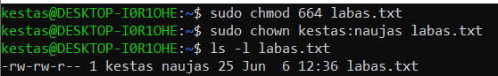
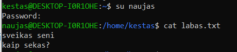
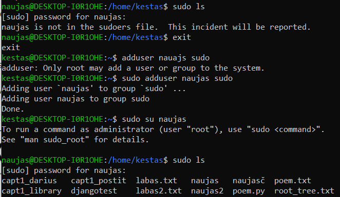

# Vartotojai, grupės, teisės

Pagal nutylėjimą, visi Linux vartotojai turi ribotas vartotojo teises. Kiekvienas failas arba katalogas turi tris teisių ribojimo lygius - vartotojas (owner / user), grupė (group) ir visi kiti vartotojai. Kiekvienas iš šių lygių turi tris privilegijas - skaitymo (read, r, svoris 4), rašymo (write, w, svoris 2), ir vykdymo (x, svoris 1). Privilegija gali būti įjungta arba išjungta. Visos privilegijų svorių skaitmeninė kombinacija visada yra unikali, ir jos išraiška telpa į vieną baitą. `ls -l` komanda išvestame failų sąraše puikiai atspindėta informacija apie failų pasiekimą.

Pirmas simbolis nurodo, ar pavadinimas yra failas (`-`), katalogas (`d`) ar simbolinė nuoroda (`l`).

Pakeisti failo prieigos teises galima komanda `chmod 666 labas.txt`. Šiuo atveju mes leisime visiems vartotojams skaityti ir rašyti failą `labas.txt`. Vartotojas, vykdantis `chmod` komandą, turi turėti `w` teises keičiamam failui ar katalogui.

Išbandykime execute privilegiją - sukurkime python poemos failą, pakeiskime jo privilegijas į execute, ir paleiskime jį:
``` bash
echo '#!/usr/bin/env python3
import this
' >poem.py
chmod 775 poem.py
./poem.py
```

`chmod` taip pat galima naudoti parametrus su operatoriais. Pvz. `chmod ugo+x poem.py` sudėtų vartotojui (`u`), grupei (`g`) ir visiems (`o`) eXecute teises. `chmod uo-w poem.py` atims rašymo teises grupei ir kitiems.

čia pirmoje eilutėje nurodėme paleidžiamo failo skripto interpretatorių. Sugeneruotą poemą išsaugoti galime tekstiniame faile `poem.txt`.
``` bash
./poem.py >poem.txt
```

---
## Supervartotojas `root`, komanda `sudo`
Yra tik vienas vartotojas, sukurtas sistemos pagal nutylėjimą, yra `root`. Root turi visas teises ir privilegijas visiems failams. `root` taip pat gali sukurti ir ištrinti kitus vartotojus, pakeisti jų slaptažodžius, valdyti visas vartotojų grupes, teises, ir prieigą prie absoliučiai visų failų ir galimybę daryti su jais viską.

Dėl saugumo sumetimų, pagal nutylėjimą `root` vartotojas taip pat neturi slaptažodžio. Vienintelis būdas tapti `root`, šiuo atveju tiksliau vykdyti komandas kaip `root`, yra `sudo` komanda. Prirašius `sudo` prie komandos, pirmą kartą prisijungimo sesijoje bus paprašyta suvesti _savo_ slaptažodį.

### Varotojų kūrimas, failų priskyrimas kitiems vartotojams bei grupėms.

Sukurkime naują vartotoją
``` bash
sudo adduser naujas
```
Paprašys įvesti naujo varotojo slaptažodį ir kitus _nebūtinus_ duomenis. Suvedus duomenis, taip pat bus sukurtas varotojui jo namų katalogas `/home/nauajas/`, ir vartotojų grupė `naujas`.

Dabar pakeisime savo `labas.txt` teises taip, kad ir `naujas` galėtų į jį rašyti, bet niekas kitas negalėtų.

``` bash
sudo chmod 664 labas.txt
sudo chown esamas_vartotojas:naujas labas.txt
```
pvz. jeigu dabar prisijungęs kaip vartotojas `kestas`


Kad prisijungti kaip nauju vartotoju, galime naudoti komanda `su`. Paprašys varototojo slaptažodžio. Naudojant `sudo su nauajas`, galima bus prisijungti prie to `naujas` vartotojo paskyros apeinant slaptažodį.

Atkreipkite dėmesį, kad `/home/kestas` nebėra `~` naujo vartotojo akimis, nes jo `~` bus `/home/naujas`.

Beje, `sudo` komanda vartotojui `naujas` neveiks, nes jis nėra `sudo` grupėje. Norint pridėti vartotoją prie `sudo`, tai reikia daryti iš jau esančio `sudo` vartotojo, arba iš `root`. Pvz.:


---
## Simbolinės nuorodos (symlinks)
Simbolinės nuorodos leidžia pasiekti tą patį kelią iš kito kelio. Simbolinė nuoroda gali nurodyti tiek į konkretų failą, tiek į katalogą. Simbolinė nuoroda paveldi nurodomo kelio vartotojo teises, nepriklausomai nuo teisių katalogo, kuriame ji būna sukurta.

`ln -s taikinys nuoroda` komanda galime sukurti nuorodą. pvz. iš vartotojo naujas sukursime nuorodą į tekstinį failą `/home/kestas/labas.txt`:
``` bash
cd ~
ln -s /home/kestas/labas.txt labas.txt
naujas@DESKTOP-I0R1OHE:~$ ls -l
total 0
lrwxrwxrwx 1 naujas naujas 22 Jun 17 11:19 labas.txt -> /home/kestas/labas.txt
```
Nuorodos, kaip minėjome, veikia tiesiogiai - jeigu pvz. perrašysime failą nuorodos pavadinimu, jo originalus turinys nuorodos gale irgi pasikeis. Pvz. su tuo pačiu `labas.txt` failu `/home/kestas` kataloge:


----
## Vartotojų ir grupių trynimas
Jeigu reikia, išsivalome ir šiukšles
``` bash
sudo deluser naujas
sudo rm -rf /home/naujas
```

Jeigu vartotojo grupėje nebėra narių, ji bus automatiškai pašalinta.
Atkreipkite dėmesį, kad `labas.txt` failas pirmo vartotojo kataloge vis dar liko, o jo grupė priskirta 1002 (sunaikintai) grupei. Kai bus sukurta sekanti grupė, ji paveldės 1002 teises. Todėl reikia ištrynus vartotoją pereiti visus failus ir jiems pertvarkyti grupės teises.

`addgroup codeacademy` komanda galima sukurti naują grupę `codeacademy`.

`delgroup codeacademy` galima ištrinti įvardintą grupę.

---
## Vartotojų ir grupių sąrašai
Peržiūrėti vartotojus ir grupes galima `/etc/` katalogo failuose `passwd` ir `group`, tam reikia `root` privilegijų. Slaptažodžiai paslėpti `shadow` faile, taip pat egzistuoja ir `gshadow`, kuriame saugomi tik vartotojų ir grupių santykiai, be ID numeriukų.
Kokioms grupėms priklauso vartotojas dar galima pažiūrėti naudojant komandą `groups`
``` bash
groups kestas
kestas : kestas adm dialout cdrom floppy sudo audio dip video plugdev netdev docker
```
